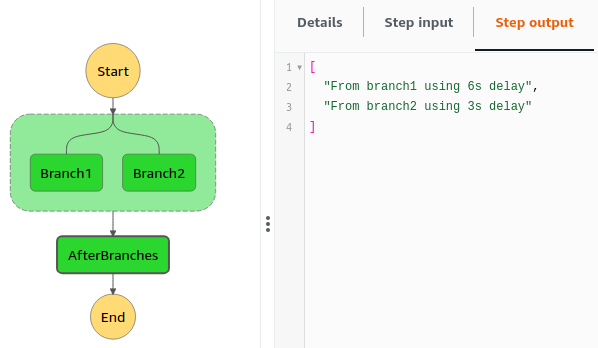

# Run parallel tasks with Step Functions
<br />
<p align="center">
  
</p>

#### Requirements
* AWS CLI
* AWS account
* Serverless Framework

#### Instructions
* Clone the repo and install the dependencies with `npm i`
* Configure your aws profile with the aws account credentials you want to use for the deployment
```bash
export AWS_DEFAULT_PROFILE=<your aws profile>
export AWS_PROFILE=$AWS_DEFAULT_PROFILE
export AWS_REGION=<aws region put on serverless.yml>
```
`TIP` You can check your current credentials with `aws configure list` 
* Deploy with
```bash
sls deploy
```
* Execute state machine
```bash
sls invoke stepf --name test --data '{"something":"irrelevant"}'
```
---
Starting repo: [Serverless Node.js Starter](https://github.com/AnomalyInnovations/serverless-nodejs-starter)
