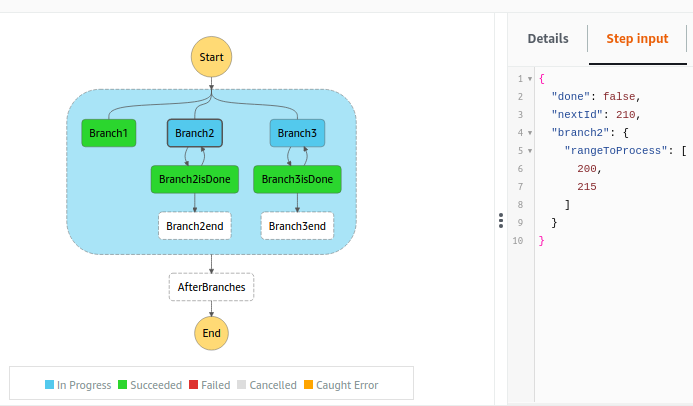
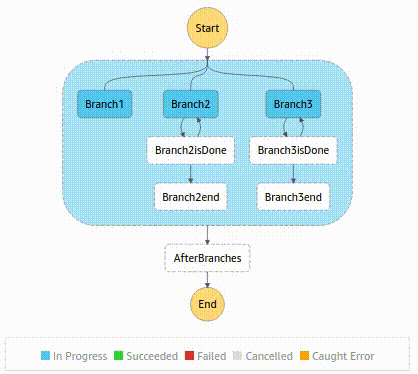

# Step Functions to process tasks longer than Lambda limited time life


The state machine has 3 parallel branches:
* Branch1: Outputs a message after 6s
* Branch2 and Branch3: Simulate the processing of a range of items `rangeToProcess`, each of them takes 1s to complete and processing the whole `rangeToProcess` exceeds the lambda limited time life. For this demo a timeout of 20s was set to lambdas, so before processing an item, lambda asks how much time is left from the 20s and in the case that is less than a `marginTime` (10s), the lambda will stop processing and return ` { done: false, nextId: <number> } ` so the following Choice state restarts the lambda from `nextId` renewing the timeout. Once all the items were processed, lambda returns `{ done: true }` so Choice directs to end the state machine.

For example, if we use as input for the step function this object:
```json
{
    "branch2": {
      "rangeToProcess": [200, 215]
    },
    "branch3": {
      "rangeToProcess": [300, 325]
    }
}
```
This is how an intermediate input for Branch2 looks like:
<br />
<p align="center">
  
</p><br />
While the whole excecution behaves like this animation:
<br />
<p align="center">
  
</p><br />

#### Requirements
* AWS CLI
* AWS account
* Serverless Framework

#### Instructions
* Clone the repo and install the dependencies with `npm i`
* Configure your aws profile with the aws account credentials you want to use for the deployment
```bash
export AWS_DEFAULT_PROFILE=<your aws profile>
export AWS_PROFILE=$AWS_DEFAULT_PROFILE
export AWS_REGION=<aws region put on serverless.yml>
```
`TIP` You can check your current credentials with `aws configure list` 
* Deploy with
```bash
sls deploy
```
* You can execute the step function with input data from the command line using for example:
```bash
sls invoke stepf --name parallelBatchProcessing --data '{ "branch2": { "rangeToProcess": [200, 215] }, "branch3": { "rangeToProcess": [300, 325] }}'
```
...or execute the step function from AWS console GUI to see how the graph changes.

---
Starting repo: [Serverless Node.js Starter](https://github.com/AnomalyInnovations/serverless-nodejs-starter)
